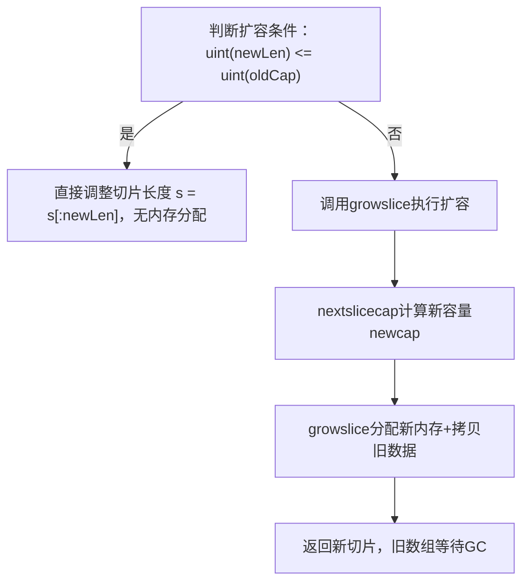

[参考资料](https://www.bilibili.com/list/watchlater?oid=116063001905367&bvid=BV1bScEzRE2v&spm_id_from=333.1007.top_right_bar_window_view_later.content.click&vd_source=d40955b0ebb31fde7200ca58917cab4e&p=14)

>  Go切片的实例化方式有很多种：
>
> ```go
> s:= []int{1,2,3,4,5}
> s1:=make([]int,3,5)
> ```


## 数据结构

`go/src/runtime/slice.go`

```go
type slice struct {
    array unsafe.Pointer //指向底层数组的指针
    len   int    //当前长度
    cap   int    //当前容量
}
```

我们现在运行`s:= make([]int,3,5)`，此时make返回的东西到底是什么呢？

我们来看一下源码：

```go
//go:linkname makeslice
// makeslice: 创建切片底层数组，返回内存指针
// et: 元素类型, len: 切片长度, cap: 切片容量
func makeslice(et *_type, len, cap int) unsafe.Pointer {
    // 计算容量对应的总内存大小，检查乘法溢出
    mem, overflow := math.MulUintptr(et.Size_, uintptr(cap))
    
    // 校验：内存溢出/超最大分配值/长度负数/长度>容量
    if overflow || mem > maxAlloc || len < 0 || len > cap {
        // 单独校验长度，区分是len还是cap越界
        mem, overflow := math.MulUintptr(et.Size_, uintptr(len))
        if overflow || mem > maxAlloc || len < 0 {
            panicmakeslicelen() // len越界panic
        }
        panicmakeslicecap()    // cap越界panic
    }

    // 分配内存并返回指针（true表示分配堆内存）
    return mallocgc(mem, et, true)
}
```

注意到：返回值是unsafe.Pointer指针，该指针实际指向的是一个slice类型的内存区域。

` [array ] [ len] [cap ]`该slice类型中array为指向底层数组第一个元素的指针。


## 特性

```go
arr := []int{10, 20, 30, 40, 50}
S₁ := arr[1:4]  // [20, 30, 40]
S₂ := arr[2:5]  //[30, 40, 50]
```

**S₁和S₂之间有什么关系呢？**

```
                  Slice S₁
                 ┌──────────────┬────────┬────────┐
                 │    Array     │  len   │  cap   │
                 └──────────────┴────────┴────────┘
                        ↓ (指向数组索引1)
        ┌───────────────────────────────────┐
        │  10  │  20  │  30  │  40  │  50  │  底层数组
        └───────────────────────────────────┘
           0      1      2      3      4
                        ↑ (指向数组索引2)
                       ┌──────────────┬────────┬────────┐
                       │    Array     │  len   │  cap   │
                       └──────────────┴────────┴────────┘
                         Slice S₂
```

1. **共享底层数组**：S₁ 和 S₂ 指向**同一块内存区域的同一个底层数组**，修改其中一个切片的元素值，另一个切片和原数组都会同步变化；

2. 指针指向位置不同：

   - S₁ 的 Array 指针指向底层数组的**索引 1（值 20）**；
   - S₂ 的 Array 指针指向底层数组的**索引 2（值 30）**；

3. len/cap 计算基准不同（基于各自指针起始位置）：

   - S₁：len=3（索引 1-3）、**cap=4**（索引 1 到数组末尾）；
   - S₂：len=3（索引 2-4）、cap=3（索引 2 到数组末尾）；

4. S1 和 S2 还是**两个独立的 slice 类型变量**，它们自身在（栈）内存中的存储地址是不同的；

   这两个切片变量内部的 `array` 指针（指向底层数组的指针），最终都指向**同一块连续的内存区域**（即同一个底层数组），只是指向该区域的不同位置。


## 扩容

#### 扩容时机

```go
s := []int{1,2} //len=2.cap=2
s = append(s,3) //触发扩容
```

向已满的切片append元素时触发扩容


#### 扩容原理

* 切片扩容时，运行时会调用 `makeslice` 分配一块新的连续内存作为新底层数组；原旧底层数组会在无任何引用时被 GC 回收。

  >  旧数组之所以大概率在堆上：
  >
  > * 触发扩容的切片，其底层数组往往因 “超出函数生命周期”（如作为返回值、全局引用）已逃逸到堆；
  > * 即使初始在栈上，扩容时新数组会分配到堆，旧数组若被扩容逻辑引用过，也会同步逃逸到堆，最终由 GC 管理。

* **倍数规则**：

  - 当旧容量 `oldcap < 256` 时，新容量为旧容量的**2 倍**
  - 当旧容量oldcap ≥ 256时，新容量为旧容量的1.25 倍
  - 注：最终容量会对齐内存页大小，保证连续内存分配的效率）


## 源码

`go/src/cmd/compile/internal/walk/assign.go`

```go
// expand append(l1, l2...) to
//
//	init {
//	  s := l1
//	  newLen := s.len + l2.len
//	  // Compare as uint so growslice can panic on overflow.
//	  if uint(newLen) <= uint(s.cap) {
//	    s = s[:newLen]
//	  } else {
//	    s = growslice(s.ptr, s.len, s.cap, l2.len, T)
//	  }
//	  memmove(&s[s.len-l2.len], &l2[0], l2.len*sizeof(T))
//	}
//	s
//
// l2 is allowed to be a string.
func appendSlice(n *ir.CallExpr, init *ir.Nodes) ir.Node {
	walkAppendArgs(n, init)

	l1 := n.Args[0]
	l2 := n.Args[1]
	l2 = cheapExpr(l2, init)
	n.Args[1] = l2

	var nodes ir.Nodes

	// var s []T
	s := typecheck.TempAt(base.Pos, ir.CurFunc, l1.Type())
	nodes.Append(ir.NewAssignStmt(base.Pos, s, l1)) // s = l1

	elemtype := s.Type().Elem()

	// Decompose slice.
	oldPtr := ir.NewUnaryExpr(base.Pos, ir.OSPTR, s)
	oldLen := ir.NewUnaryExpr(base.Pos, ir.OLEN, s)
	oldCap := ir.NewUnaryExpr(base.Pos, ir.OCAP, s)

	// Number of elements we are adding
	num := ir.NewUnaryExpr(base.Pos, ir.OLEN, l2)

	// newLen := oldLen + num
	newLen := typecheck.TempAt(base.Pos, ir.CurFunc, types.Types[types.TINT])
	nodes.Append(ir.NewAssignStmt(base.Pos, newLen, ir.NewBinaryExpr(base.Pos, ir.OADD, oldLen, num)))

	// if uint(newLen) <= uint(oldCap)
	nif := ir.NewIfStmt(base.Pos, nil, nil, nil)
	nuint := typecheck.Conv(newLen, types.Types[types.TUINT])
	scapuint := typecheck.Conv(oldCap, types.Types[types.TUINT])
	nif.Cond = ir.NewBinaryExpr(base.Pos, ir.OLE, nuint, scapuint)
	nif.Likely = true

	// then { s = s[:newLen] }
	slice := ir.NewSliceExpr(base.Pos, ir.OSLICE, s, nil, newLen, nil)
	slice.SetBounded(true)
	nif.Body = []ir.Node{ir.NewAssignStmt(base.Pos, s, slice)}

	// else { s = growslice(oldPtr, newLen, oldCap, num, T) }
	call := walkGrowslice(s, nif.PtrInit(), oldPtr, newLen, oldCap, num)
	nif.Else = []ir.Node{ir.NewAssignStmt(base.Pos, s, call)}

	nodes.Append(nif)

	// Index to start copying into s.
	//   idx = newLen - len(l2)
	// We use this expression instead of oldLen because it avoids
	// a spill/restore of oldLen.
	// Note: this doesn't work optimally currently because
	// the compiler optimizer undoes this arithmetic.
	idx := ir.NewBinaryExpr(base.Pos, ir.OSUB, newLen, ir.NewUnaryExpr(base.Pos, ir.OLEN, l2))

	var ncopy ir.Node
	if elemtype.HasPointers() {
		// copy(s[idx:], l2)
		slice := ir.NewSliceExpr(base.Pos, ir.OSLICE, s, idx, nil, nil)
		slice.SetType(s.Type())
		slice.SetBounded(true)

		ir.CurFunc.SetWBPos(n.Pos())

		// instantiate typedslicecopy(typ *type, dstPtr *any, dstLen int, srcPtr *any, srcLen int) int
		fn := typecheck.LookupRuntime("typedslicecopy", l1.Type().Elem(), l2.Type().Elem())
		ptr1, len1 := backingArrayPtrLen(cheapExpr(slice, &nodes))
		ptr2, len2 := backingArrayPtrLen(l2)
		ncopy = mkcall1(fn, types.Types[types.TINT], &nodes, reflectdata.AppendElemRType(base.Pos, n), ptr1, len1, ptr2, len2)
	} else if base.Flag.Cfg.Instrumenting && !base.Flag.CompilingRuntime {
		// rely on runtime to instrument:
		//  copy(s[idx:], l2)
		// l2 can be a slice or string.
		slice := ir.NewSliceExpr(base.Pos, ir.OSLICE, s, idx, nil, nil)
		slice.SetType(s.Type())
		slice.SetBounded(true)

		ptr1, len1 := backingArrayPtrLen(cheapExpr(slice, &nodes))
		ptr2, len2 := backingArrayPtrLen(l2)

		fn := typecheck.LookupRuntime("slicecopy", ptr1.Type().Elem(), ptr2.Type().Elem())
		ncopy = mkcall1(fn, types.Types[types.TINT], &nodes, ptr1, len1, ptr2, len2, ir.NewInt(base.Pos, elemtype.Size()))
	} else {
		// memmove(&s[idx], &l2[0], len(l2)*sizeof(T))
		ix := ir.NewIndexExpr(base.Pos, s, idx)
		ix.SetBounded(true)
		addr := typecheck.NodAddr(ix)

		sptr := ir.NewUnaryExpr(base.Pos, ir.OSPTR, l2)

		nwid := cheapExpr(typecheck.Conv(ir.NewUnaryExpr(base.Pos, ir.OLEN, l2), types.Types[types.TUINTPTR]), &nodes)
		nwid = ir.NewBinaryExpr(base.Pos, ir.OMUL, nwid, ir.NewInt(base.Pos, elemtype.Size()))

		// instantiate func memmove(to *any, frm *any, length uintptr)
		fn := typecheck.LookupRuntime("memmove", elemtype, elemtype)
		ncopy = mkcall1(fn, nil, &nodes, addr, sptr, nwid)
	}
	ln := append(nodes, ncopy)

	typecheck.Stmts(ln)
	walkStmtList(ln)
	init.Append(ln...)
	return s
}
```

### 整体流程




### 扩容条件判断

```go
// if uint(newLen) <= uint(oldCap)
nif := ir.NewIfStmt(base.Pos, nil, nil, nil)
nuint := typecheck.Conv(newLen, types.Types[types.TUINT])
scapuint := typecheck.Conv(oldCap, types.Types[types.TUINT])
nif.Cond = ir.NewBinaryExpr(base.Pos, ir.OLE, nuint, scapuint)
nif.Likely = true

// then { s = s[:newLen] }
slice := ir.NewSliceExpr(base.Pos, ir.OSLICE, s, nil, newLen, nil)
slice.SetBounded(true)
nif.Body = []ir.Node{ir.NewAssignStmt(base.Pos, s, slice)}

// else { s = growslice(oldPtr, newLen, oldCap, num, T) }
call := walkGrowslice(s, nif.PtrInit(), oldPtr, newLen, oldCap, num)
nif.Else = []ir.Node{ir.NewAssignStmt(base.Pos, s, call)}

nodes.Append(nif)
```

**核心逻辑**：

- 用`uint`转换后比较，避免负数导致的扩容判断错误；

- `nif.Likely = true`：编译器优化，标记 “大概率不扩容”，提升分支预测效率；

- 不扩容则直接调整切片长度，扩容则调用`growslice`。

  

### 新容量计算（nextslicecap）

```go
func nextslicecap(newLen, oldCap int) int {
	newcap := oldCap
	doublecap := newcap + newcap
	if newLen > doublecap {
		return newLen
	}

	const threshold = 256
	if oldCap < threshold {
		return doublecap
	}
	for {
		// 等价于 newcap = newcap * 1.25（位运算优化）
		newcap += (newcap + 3*threshold) >> 2
		if uint(newcap) >= uint(newLen) {
			break
		}
	}

	if newcap <= 0 {
		return newLen
	}
	return newcap
}
```

**核心逻辑（扩容倍数来源）**：

| 场景         | 扩容倍数 | 计算方式                                                     | 备注                                                         |
| ------------ | -------- | ------------------------------------------------------------ | ------------------------------------------------------------ |
| oldCap < 256 | 2 倍     | `doublecap = newcap + newcap`                                | 小切片快速扩容，适配高频操作                                 |
| oldCap ≥ 256 | 1.25 倍  | `newcap += (newcap + 768) >> 2`                              | 位运算替代乘法（`>>2`= 除以 4），等价于 `newcap = newcap * 1.25`，平缓扩容减少内存浪费 |
| 兜底逻辑     | -        | 若 newLen > 双倍容量，直接返回 newLen；扩容溢出则返回 newLen | 保证容量满足最小需求                                         |

### 实际扩容（growslice）

```go
func growslice(oldPtr unsafe.Pointer, newLen, oldCap, num int, et *_type) slice {
	oldLen := newLen - num
	// 省略竞态检测/内存检测代码...

	if newLen < 0 {
		panic(errorString("growslice: len out of range"))
	}

	if et.Size_ == 0 {
		return slice{unsafe.Pointer(&zerobase), newLen, newLen}
	}

	// 第一步：调用nextslicecap计算新容量
	newcap := nextslicecap(newLen, oldCap)

	// 第二步：计算内存大小（按元素类型优化）
	var overflow bool
	var lenmem, newlenmem, capmem uintptr
	noscan := !et.Pointers()
	switch {
	case et.Size_ == 1:
		lenmem = uintptr(oldLen)
		newlenmem = uintptr(newLen)
		capmem = roundupsize(uintptr(newcap), noscan)
		overflow = uintptr(newcap) > maxAlloc
		newcap = int(capmem)
	case et.Size_ == goarch.PtrSize:
		lenmem = uintptr(oldLen) * goarch.PtrSize
		newlenmem = uintptr(newLen) * goarch.PtrSize
		capmem = roundupsize(uintptr(newcap)*goarch.PtrSize, noscan)
		overflow = uintptr(newcap) > maxAlloc/goarch.PtrSize
		newcap = int(capmem / goarch.PtrSize)
	case isPowerOfTwo(et.Size_):
		// 2的幂大小元素，用位运算优化乘法
		var shift uintptr
		if goarch.PtrSize == 8 {
			shift = uintptr(sys.TrailingZeros64(uint64(et.Size_))) & 63
		} else {
			shift = uintptr(sys.TrailingZeros32(uint32(et.Size_))) & 31
		}
		lenmem = uintptr(oldLen) << shift
		newlenmem = uintptr(newLen) << shift
		capmem = roundupsize(uintptr(newcap)<<shift, noscan)
		overflow = uintptr(newcap) > (maxAlloc >> shift)
		newcap = int(capmem >> shift)
		capmem = uintptr(newcap) << shift
	default:
		lenmem = uintptr(oldLen) * et.Size_
		newlenmem = uintptr(newLen) * et.Size_
		capmem, overflow = math.MulUintptr(et.Size_, uintptr(newcap))
		capmem = roundupsize(capmem, noscan)
		newcap = int(capmem / et.Size_)
		capmem = uintptr(newcap) * et.Size_
	}

	// 内存溢出检查
	if overflow || capmem > maxAlloc {
		panic(errorString("growslice: len out of range"))
	}

	// 第三步：分配新内存
	var p unsafe.Pointer
	if !et.Pointers() {
		p = mallocgc(capmem, nil, false)
		// 仅清零未被覆盖的内存区域
		memclrNoHeapPointers(add(p, newlenmem), capmem-newlenmem)
	} else {
		// 指针类型需清零内存，避免GC扫描未初始化内存
		p = mallocgc(capmem, et, true)
		if lenmem > 0 && writeBarrier.enabled {
			bulkBarrierPreWriteSrcOnly(uintptr(p), uintptr(oldPtr), lenmem-et.Size_+et.PtrBytes, et)
		}
	}

	// 第四步：拷贝旧数组数据到新内存
	memmove(p, oldPtr, lenmem)

	// 返回新切片（新指针+newLen+newcap）
	return slice{p, newLen, newcap}
}
```

**核心逻辑**：

- 内存计算优化：针对`Size=1`、指针大小、2 的幂等常见元素类型，用位运算替代乘除，提升效率；
- 内存分配：
  - 非指针类型：分配未清零内存，仅清零 “新长度到新容量” 的空白区域，减少开销；
  - 指针类型：分配并清零内存，保证 GC 安全；
- 数据拷贝：通过`memmove`将旧数组的`oldLen`长度有效数据拷贝到新内存；
- 返回值：新切片包含 “新内存指针 + 目标新长度 + 计算后的新容量”。

### 新旧数组关系

| 对比项   | 旧数组                                             | 新数组                                           |
| -------- | -------------------------------------------------- | ------------------------------------------------ |
| 内存位置 | 堆内存（扩容切片多逃逸到堆）                       | 堆内存（`mallocgc`分配）                         |
| 数据拷贝 | 仅拷贝`oldLen`长度的有效数据，旧数组剩余空间不处理 | 接收旧数组有效数据，新长度到新容量的区域按需清零 |
| 生命周期 | 无任何引用时被 GC 回收；若有其他切片引用则保留     | 由新切片持有，随新切片生命周期管理               |
| 关联性   | 与新数组是独立内存块，修改新数组不影响旧数组       | 完全替代旧数组成为切片的底层存储                 |

### 总结

1. 扩容触发条件：新长度`newLen`超过旧容量`oldCap`，否则仅调整切片长度；
2. 扩容倍数：256 为阈值，小切片 2 倍扩容、大切片 1.25 倍扩容（位运算优化计算）；
3. 新旧数组：独立堆内存，旧数组无引用则 GC，新数组仅拷贝旧数组有效数据；
4. 性能优化：通过位运算、分类型内存计算、选择性清零等方式降低扩容开销。
